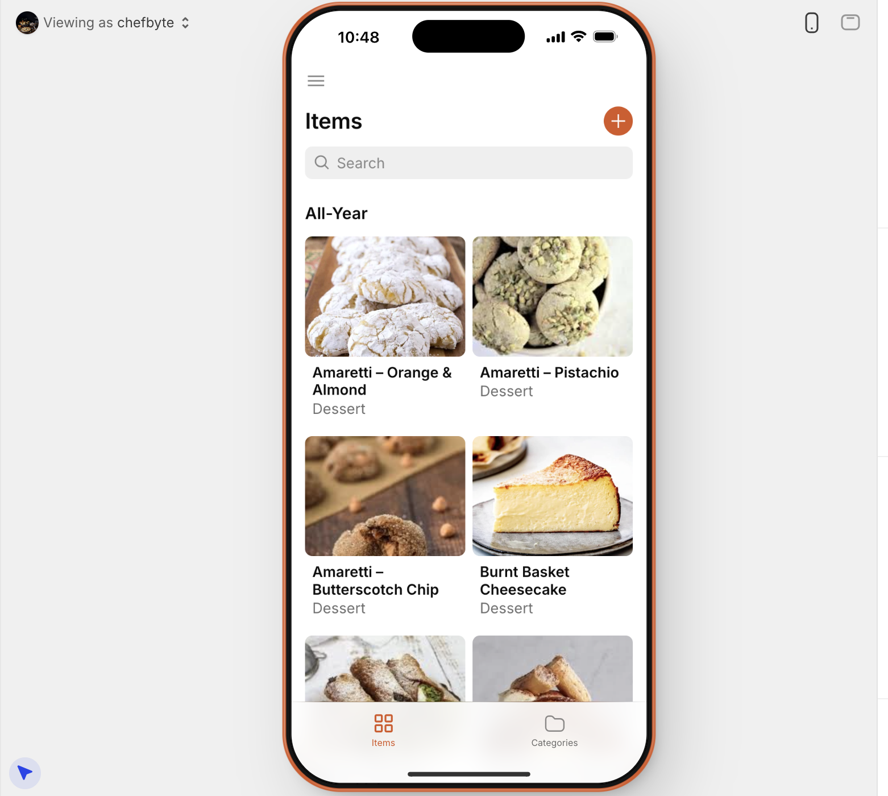

🍽️ Restaurant Menu & Inventory Tracker (No-Code Project)

📁 This repo documents a no-code solution for restaurant operations, built in Airtable and extended with an optional Glide app for mobile ordering.

## 🔍 Overview

This project helps restaurants and cafes:
- Track ingredient inventory in real time
- Log additions, usage, and spoilage
- Dynamically manage active menu items based on ingredient availability
- Prototype a mobile app for digital menu browsing and simple order capture
- Lay the foundation for future cost analysis and supplier tracking

Built using Airtable with a focus on operations logic, not code.

## ⚙️ Tools Used

- **Airtable** – For managing inventory, menu items, and usage logs with no-code logic
- **Glide** – For building a mobile-friendly digital dessert menu and order form without writing code
- **CSV Import** – For loading sample ingredient and menu data
- **GitHub** – For documenting, versioning, and showcasing project work
- **Python (Pandas)** – Used to clean and export sample data to CSV for Glide import

## 🧩 Key Tables

- **Ingredients**: Units, costs, stock levels, and suppliers
- **Dishes (Recipes)**: Menu items with associated ingredients
- **Inventory Log**: Add/Subtract/Spoiled tracking
- **Suppliers** *(optional)*: Linked list of providers (can be added later)

## 📸 Screenshots

Add screenshots from Airtable here:

- `screenshots/ingredients-table.png`
- `screenshots/dishes-table.png`
- `screenshots/inventory-log.png`

## 🌐 Live Airtable Base

🔗 [View the Airtable base (read-only)](https://airtable.com/appT6DLDxU8NRPGw6/pagGkBa0LNGe5uJJc/preview?app_preview=true)

## 📈 Future Enhancements

- Link ingredients to supplier records
- Add cost-per-dish rollups
- Create menu availability logic tied to inventory
- Connect to a Glide App for mobile front-of-house interface
  
## 🍰 Digital Dessert Menu Prototype (Glide App)

This mobile-friendly dessert menu prototype was built using [Glide](https://www.glideapps.com/) as a proof of concept for a chef-driven ordering experience. It complements the Airtable inventory system by simulating front-of-house menu browsing and simple order submission.

### 📱 Try the App

[➡️ View the Live App](https://digital-dessert-menu.glide.page/dl/a400f7)

Best viewed on mobile. No login required.

### 🖼️ App Preview

### 🔧 Built With

- [Glide](https://www.glideapps.com/) — for building the mobile app UI
- Sample data & photos from Pexels and Pixabay
- CSV formatting done in Python for easy import

### 💡 What It Demonstrates

- Menu item grouping by seasonal tag (Spring, Summer, etc.)
- Phased rollout status and training checkboxes
- Tap-to-order functionality with quantity + table number form
  
## 🧠 What I Learned

- How to design real-world workflows using Airtable
- How to simulate inventory, cost, and menu logic with no code
- How to document and present a technical project on GitHub
  
## 📬 Contact

Project by `@chefbyte`  
